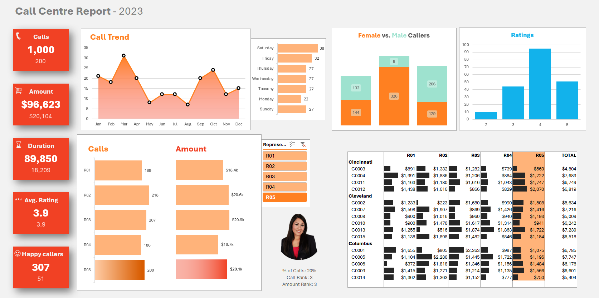

# 📊 Call Center Performance Analysis  

This project showcases an exploratory analysis of **call center performance data** using Microsoft Excel.  
The focus was on applying data analytics techniques such as **Pivot Tables**, **Power Pivot**, **DAX**, and interactive dashboards to derive insights from raw data.

## 🔎 Project Overview  
The analysis provides insights into how call center representatives are performing based on multiple dimensions of customer interaction.  
Key outcomes include:  
- Tracking **call volumes** and customer activity.  
- Understanding **customer satisfaction** through rating distributions.  
- Measuring **sales performance** via purchase amounts.  
- Comparing **individual representative performance** dynamically.  
- Building an **interactive dashboard** that updates seamlessly when exploring specific employees or metrics.

## 🖥️ Dashboard Preview  
  

## 📈 Dashboard Highlights  
The dashboard brings the key performance details together in a clear and simple view:  
- **High-level KPIs** for calls handled, purchases made, and customer happiness.  
- **Trend and distribution visuals** to identify patterns in customer ratings and call activity.  
- **Representative-level comparisons**, enabling managers to quickly spot strengths and areas for improvement.  
- A design that makes the analysis **dynamic and filterable**, offering flexibility in exploring data across different employees.  

## ⚙️ Tools & Skills Practiced  
- Microsoft Excel  
- Pivot Tables & Charts  
- Power Pivot  
- DAX Formulas  
- Dashboard Design  
